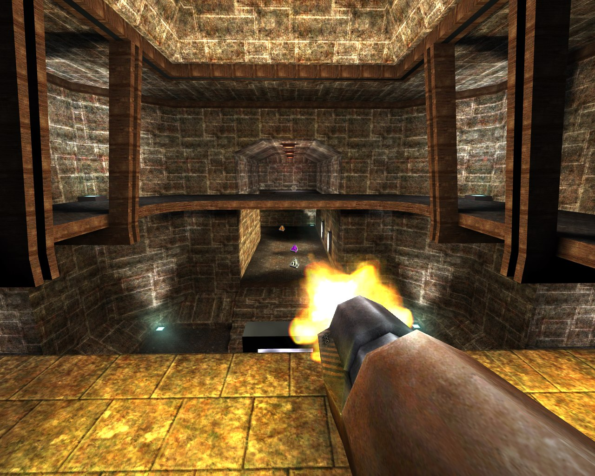

# Quake3's Fast Inverse Square Root

Fast inverse square root is an algorithm which computes the inverse square root of a 32-bit floating-point number x in IEEE 754 floating-point format. It is well-known for its implementation in 1999 in Quake III Arena, a first-person shooter video game heavily based on 3D graphics.

Indeed, computer graphics programs use inverse square roots to normalize vectors and to compute angles of incidence and reflection for lighting and shading. 

## Requirements

Write a program which implements the original version of this algorithm (which can be found at https://www.beyond3d.com/content/articles/8/).

The program must be compare its performance with respect to a standard algortihm that can be easily implemented in C++ in terms of time and precision.

More precisely, program must compute time elapsed for doing *n* tests (where *n* is a *command line arguments* of the program) with both alogirthms and print on the standard output the best algorithm in terms of time performance.

Furthermore, the program must compare results obtained from the application of both algorithms by computing the minimum, the average and the maximum relative error (assuming the standard results as correct). Also in this case, results in terms of relative error must be print on the screen.
