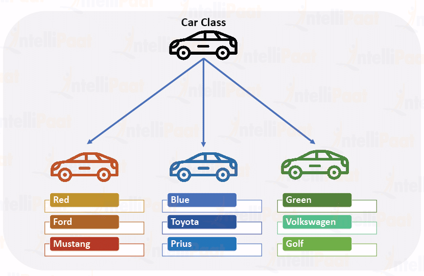

# Car Factory

On a car brochure, a car is identified by the following properties:

* Color
* Producer
* Model

## Example 

See the image below as an example of three different cars



## Requirements

Write a software which emulate a car factory who produces a car on the brochure and tests the whole procedure.

### Basic

The mechanism is as follows:

 - A `CarFactory` object starts the production with a `CarProducer` (UNKWON 'U', FORD 'F', TOYOTA 'T', VOLKSWAGEN 'V');
 - A new `Car` of a model which depends on producer ('F' produces "Mustang", 'T' produces "Prius", 'V' produces "Golf", while 'U' does not produce anything) is created given a color;
 - Show() returns information about the created car.

The format required of function `Show()` of class `Car` is the following:
```c++
model + " (" + producer + "): color " + color
```
**Example**
```c++
"Mustang (Ford): color Red"
```
